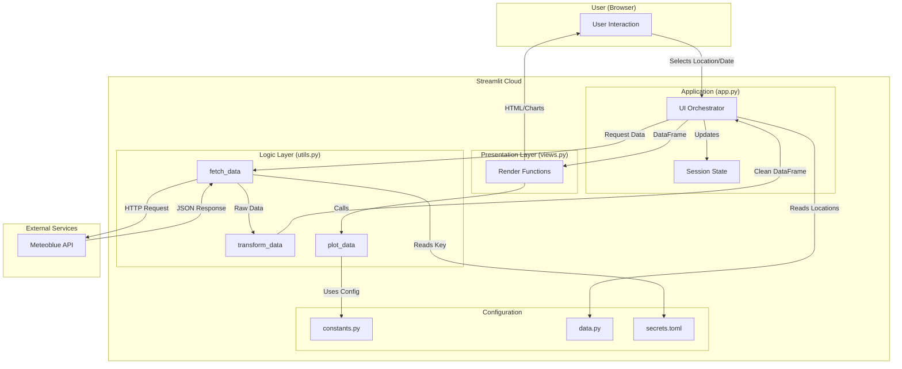

# Peru Regional Telemetry: Streamlit Dashboard

### **By George Freedom**

A strategic data visualization tool built with **Streamlit**, designed to monitor atmospheric telemetry across 7 key regions in Peru.

This project demonstrates a robust, end-to-end **ETL (Extract, Transform, Load)** pipeline: capturing raw signals from a remote REST API, refining the dataset with Pandas, and projecting actionable insights via interactive Matplotlib visualizations.

It serves as a practical blueprint for **data-driven application development**, bridging the gap between raw data ingestion and user-facing intelligence using a modern, AI-augmented workflow.

### ⚙️ Core System Capabilities:
It demonstrates key engineering concepts including:

* **Data Extraction (API Integration):** Establishing a comms link to consume external REST APIs (Meteoblue) and ingest raw environmental data.
* **Data Transformation (Engineering):** The core processing engine. Cleaning, structuring, and smoothing time-series data using **Pandas** to turn noise into signal.
* **Visual Intelligence:** Rendering high-precision, custom static charts with **Matplotlib** to visualize trends and anomalies.
* **System Architecture:** Optimizing performance and user experience through **Streamlit's** advanced features (`session_state` for memory, `@st.cache_data` for speed, and modular component design).
* **Security Protocols:** Managing sensitive credentials and API keys securely within the deployment environment.

---

## 🚀 Key Features

* **Interactive Location Selection:** Users can dynamically select from a predefined list of strategic locations in Peru (provinces and cities).
* **Smart Caching:** Minimizes API calls and latency by caching data responses using Streamlit's caching mechanism.
* **7-Day Forecast Overview:** A comprehensive look at temperature trends (actual vs. felt) and precipitation types for the upcoming week.
* **Deep Dive 24h Detail:** An interactive date picker allows users to drill down into hourly data for any specific day in the forecast.
* **Data Smoothing:** Implements rolling averages to visualize temperature trends more clearly.
* **Robust Error Handling:** Handles API failures or missing data with user-friendly messages.

---

## 🏗️ Project Architecture

The application follows a **modular architecture** to separate concerns between data fetching, processing, and presentation. The logic is decoupled from the UI, making the code testable and maintainable.

### System Diagram



## File Structure

```
peru-regional-telemetry/
│
├── app.py                  # Main application entry point (Orchestrator)
├── notebook.ipynb          # 🔬 Data Exploration Lab (Prototyping & Analysis)
├── utils.py                # Core logic: Data fetching, transformation, and plotting
├── views.py                # Presentation logic: Rendering UI components
├── data.py                 # Static data definitions (Locations list)
├── constants.py            # Centralized configuration (Labels, formats, settings)
│
├── .streamlit/             # Streamlit configuration (NOT in Git)
│   └── secrets.toml        # API keys and secrets
│
├── requirements.txt        # Python dependencies
├── .gitignore              # Files ignored by Git
└── README.md               # This file
```

## 💡 Development Philosophy & AI Collaboration
This project was built using a "Human-Architect, AI-Builder" methodology.

The process involved:

**Human-led Strategy:** Defining the project goals (visualization of specific telemetry data), the architectural pattern (separation of views and logic), and the visual design.

**AI-assisted Exploration (Jupyter):** Using AI to help explore the complex JSON structure of the API response and prototype the Pandas transformations in a Jupyter Notebook.

**AI-assisted Implementation (Copilot):** generating boilerplate code for charts and repetitive UI elements based on the defined architecture.

**Human-driven Refactoring:** Manually refactoring the prototype into clean, modular functions (views.py, utils.py) and enforcing type hinting and docstrings.

This workflow demonstrates how AI tools can accelerate the "heavy lifting" of coding while the developer focuses on system design, data correctness, and user experience.

## 🔬 Data Analysis & Prototyping

This repository includes a **Jupyter Notebook** (`notebook.ipynb`) that documents the initial research phase. 
It demonstrates:
* Raw API response analysis and structure exploration.
* Step-by-step data cleaning and transformation strategy using **Pandas**.
* Visualization prototyping using **Matplotlib** before implementation in Streamlit.

## ⚙️ Setup and running

1.  **Clone the Repository:**
    ```bash
    git clone https://github.com/GeorgeFreedomTech/peru-regional-telemetry.git
    cd peru-regional-telemetry
    ```
2.  **Create and Activate a Virtual Environment:**
    ```bash
    python -m venv venv
    # On Windows: venv\Scripts\activate
    # On macOS/Linux: source venv/bin/activate
    ```
3.  **Install Dependencies:**
    ```bash
    pip install -r requirements.txt
    ```
4.  **Configure Secrets:** Create a .streamlit folder and a secrets.toml file inside it:
    ```bash
    mkdir .streamlit
    # Create secrets.toml and add your API key:
    # METEOBLUE_API_KEY = "your_api_key_here"
    ```
5.  **Run the App:**
    ```bash
    streamlit run app.py
    ```

## 🔗 Let's Connect:

* Visit my website: **[https://GeorgeFreedom.com](https://GeorgeFreedom.com)**
* Connect on LinkedIn: **[https://www.linkedin.com/in/georgefreedom/](https://www.linkedin.com/in/georgefreedom/)**
* Let's talk: **[https://cal.com/georgefreedom](https://cal.com/georgefreedom)**


## 📜 License:

Copyright (c) 2025 Jiří Svoboda (George Freedom) / George Freedom Tech

This project is licensed under:
* Creative Commons Attribution-NonCommercial-ShareAlike 4.0 International License

---

We build for the Future!

